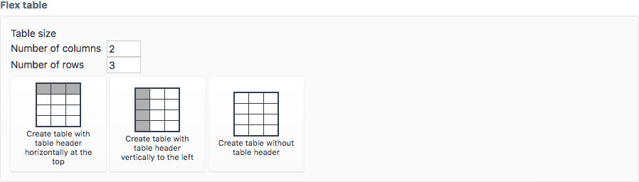

# FlexTable plugin for Craft CMS 3.x


This field type makes creating and editing tables in Craft a breeze.



## Requirements

This plugin requires Craft CMS 3.0.0 or later.

## Installation

To install the plugin, follow these instructions.

1. Open your terminal and go to your Craft project:

        cd /path/to/project

2. Then tell Composer to load the plugin:

        composer require knutsv/flex-table

3. In the Control Panel, go to Settings → Plugins and click the “Install” button for FlexTable.

## NOTE
This field type is under development. Try it out, but it's a bit ruff around the edges.

## FlexTable Overview

* Edit tables like in Excel or other spreadsheet programs, enter creates a new line, tab adds a new column
* Creates accessible tables with table headers and table caption

## Using FlexTable

Create a new field and choose the FlexTable field type and add the field to an entry type.

When you edit an entry of this type you will get the option to add a table. You can choose the number of rows and columns to create the table with, and you can choose a table header layout to start with. Header row, header column or no headers. All of this can be changed later.

When editing a table click inside a cell. You can begin typing, or you can move to differen cells uting `tab`, `shift + tab`, or the arrow keys.

If you select a cell (without editing the contents) you can right click to get a context menu. This menu lets you add rows and columns, change cell, row or column type, and change cell, row or column alignment. You can also delete rows and columns.

## Templating
You can use the data returned from the field like so:
```twig
  <table>
    <caption>{{ entry.field.meta.caption }}</caption>
    <thead>
      
        <tr>
          
            <{{ cell.type }} align="{{ cell.align }}">{{ cell.text }}</{{ cell.type }}>
          
        </tr>
      
    </thead>
    <tbody>
      
        <tr>
          
            <{{ cell.type }} align="{{ cell.align }}">{{ cell.text }}</{{ cell.type }}>
          
        </tr>
      
    </tbody>
  </table>
```

## FlexTable Roadmap

Some things to do, and ideas for potential features:

* Browsertesting (currently only tested in Chrome)
* Major GUI-improvements (make it more Excel-like)
* Implement copy/paste (import) from Excel/CSV

Brought to you by [Knut Svangstu](https://vangenplotz.no/)
